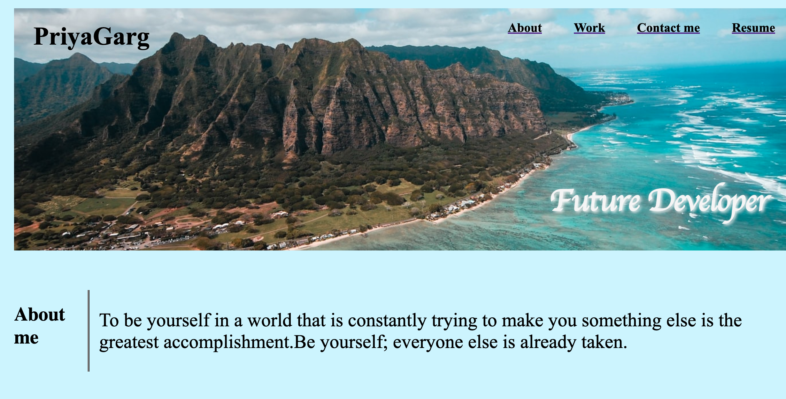

<h1>Overview</h1>

I really enjoyed working on it and spent my time i could on it. It's an expandable Project and will continue add on to this portfolio.
This portfolio is in my github page and it will help me organize my projects, events, and writing and then display 'em to the world.
 

<h1>Description</h1>
This site is a home page for my portfolio. It is the first independent project. It will show previous work history, schools attended and have links to my Github page.

 

<h1>Setup/Installation Requirements</h1>
Open terminal or a similar app on your computer
change directory to Desktop
copy https://github.com/guptaria/guptaria.github.io.git
use git clone and paste that link after it to clone the repository
open the folder it provides
open the HTML folder inside
https://github.com/guptaria/guptaria.github.io

 

<h1>Assets</h1>

<h2>Screenshots</h2>

 

<h1>Technologies Used:</h1>
HTML 
CSS 
